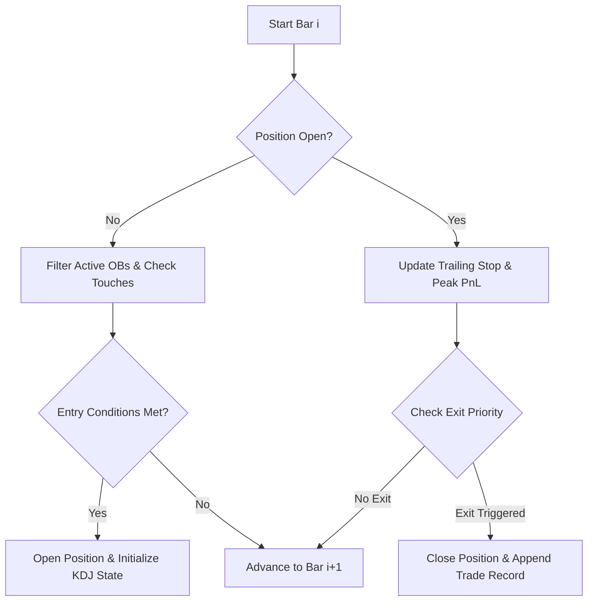

# Comprehensive Technical Walkthrough: Backtesting Methodology & Defense Guide

> **Asset & Timeframe**: `BTCUSDT` 4H  
> **Backtest Window**: 2022-01-01 00:00:00 to 2026-01-01 00:00:00 (8,767 Candles)  
> **Baseline Performance**: $N = 27$ Trades | Win Rate = **70.37%** (19W / 8L) | Total Net Return = **+30.31%**  

---

## 1. Data Ingestion & Preprocessing Pipeline

### 1.1 Data Source & API Endpoint
* **Exchange API**: Binance REST API (`https://api.binance.com`) via `python-binance` Client (`client.get_klines`).
* **Symbol & Interval**: `symbol="BTCUSDT"`, `interval=Client.KLINE_INTERVAL_4HOUR`.
* **Date Boundaries**: 
  * `start_time` = `2022-01-01 00:00:00` ($1,640,995,200,000 \text{ ms}$)
  * `end_time` = `2026-01-01 00:00:00` ($1,767,225,600,000 \text{ ms}$)

### 1.2 Pagination Logic
Binance limits `get_klines` queries to 1,000 candles per API request. Ingestion executes in a synchronous `while True:` loop:
```python
start_ms = int(start_time.timestamp() * 1000)
end_ms   = int(end_time.timestamp() * 1000)

candles = []
while True:
    batch = client.get_klines(
        symbol="BTCUSDT", interval="4h",
        startTime=start_ms, endTime=end_ms, limit=1000
    )
    if not batch: break
    candles.extend(batch)
    last_time = batch[-1][0]
    if end_ms and last_time >= end_ms: break
    start_ms = last_time + 1
```

### 1.3 Timezone Alignment & Storage Schema
* **Timestamp Normalization**: Raw Binance open timestamps are in UTC milliseconds. Converted to Asia/Singapore (UTC+8):
  $$\text{open\_time} = \text{pd.to\_datetime}(\text{open\_time}, \text{unit='ms'}) + \text{pd.Timedelta}(\text{hours}=8)$$
* **Type Conversion**: `open`, `high`, `low`, `close`, `volume`, `num_trades`, `taker_buy_base` cast explicitly to `float64`.
* **Storage Artifacts**:
  1. `artifacts/candles.csv` & `artifacts/candles.json` (Local flat files).
  2. `backtest_results.db` (SQLite relational database table `Candle`).

---

## 2. Upfront Indicator Calculation (`compute_indicators`)

Indicators are computed **once** over the complete 8,767-bar DataFrame prior to trade simulation.

### 2.1 MACD (12, 26, 9)
* **Fast & Slow EMAs** (using `adjust=False`):
  $$EMA_{12}(t) = \text{Close}_t \times \left(\frac{2}{13}\right) + EMA_{12}(t-1) \times \left(1 - \frac{2}{13}\right)$$
  $$EMA_{26}(t) = \text{Close}_t \times \left(\frac{2}{27}\right) + EMA_{26}(t-1) \times \left(1 - \frac{2}{27}\right)$$
* **MACD Line & Signal Line**:
  $$\text{MACD}_t = EMA_{12}(t) - EMA_{26}(t)$$
  $$\text{Signal}_t = \text{MACD}_t \times \left(\frac{2}{10}\right) + \text{Signal}_{t-1} \times \left(1 - \frac{2}{10}\right)$$
  $$\text{Histogram}_t = \text{MACD}_t - \text{Signal}_t$$

### 2.2 Average True Range: ATR(14) & ATR(200)
* **True Range ($TR_t$)**:
  $$TR_t = \max\left(H_t - L_t, \, |H_t - C_{t-1}|, \, |L_t - C_{t-1}|\right)$$
* **Smoothing Formula**: Computed as a **Simple Rolling Mean (SMA)** over $N$ periods:
  $$ATR_{14}(t) = \frac{1}{14} \sum_{i=0}^{13} TR_{t-i}, \quad ATR_{200}(t) = \frac{1}{200} \sum_{i=0}^{199} TR_{t-i}$$
  > ⚠️ **Implementation Note**: `src/Binance backtest bot.py` line 166 mentions Wilder's RMA in comments, but the executable Python code executes `tr.rolling(n).mean()`. The strategy uses Simple Rolling Mean for both ATRs.

* **Downstream ATR Usage**:
  - $ATR_{14}$: Stop-loss distance ($0.5 \times ATR_{14}$), minimum SL ratio filter ($1.5\%$), trailing stop triggers, and ATR move exits ($1.8 \times ATR_{14}$).
  - $ATR_{200}$: Volatility regime filter ($ATR_{14} / ATR_{200}$ dead-zone check), displacement body threshold ($1.5 \times ATR_{200}$), and large bar filter ($High - Low \ge 1.0 \times ATR_{200}$).

### 2.3 Base KDJ Indicator (9, 3, 3)
* **Raw Stochastic Value ($RSV_t$)**:
  $$RSV_t = \frac{C_t - \min_{i \in [0, 8]} L_{t-i}}{\max_{i \in [0, 8]} H_{t-i} - \min_{i \in [0, 8]} L_{t-i}} \times 100$$
* **Smoothing ($\alpha = 1/3$)**:
  $$K_t = \frac{2}{3} K_{t-1} + \frac{1}{3} RSV_t, \quad D_t = \frac{2}{3} D_{t-1} + \frac{1}{3} K_t$$
  $$J_t = 3 K_t - 2 D_t$$

---

## 3. The Adaptive KDJ Lookback Mechanism

### 3.1 Motivation & Concept
Standard KDJ(9,3,3) uses a static 9-period window. When a trade is entered from an Order Block, the age of the structure ($\text{entry\_index} - \text{ob\_origin\_bar}$) represents the macro consolidation length. The adaptive mechanism dynamically matches the KDJ lookback window to the age of the triggering Order Block.

### 3.2 Code Path & Execution Sequence

```
1. Entry Trigger (bar i)  ──>  kdj_reset_init(df, i, ob_bar)
2. Trade Active (bar i+k) ──>  kdj_reset_update(state, df, cur_idx, side)
3. Exit Evaluation        ──>  kdj_reset_exit(state, side)
```

#### Step A: Initialization (`kdj_reset_init`)
When a trade opens at bar `entry_idx` for an Order Block originating at `ob_bar`:
$$\text{period} = \max\left(1, \, \text{entry\_idx} - \text{ob\_bar}\right)$$
* `state['period']` is set to $\text{period}$.
* `state['k']` and `state['d']` are initialized using the **global** $K$ and $D$ values at `entry_idx`.
* `state['armed']` is initialized to `False`.

#### Step B: Bar-by-Bar Custom Smoothing (`kdj_reset_update`)
On every active trade bar $cur\_idx > entry\_idx$:
1. A custom $RSV$ is computed over the dynamic window $[cur\_idx - \text{period} + 1, \, cur\_idx]$:
   $$\text{Highest} = \max_{j \in [cur\_idx - \text{period} + 1, cur\_idx]} High_j, \quad \text{Lowest} = \min_{j \in [cur\_idx - \text{period} + 1, cur\_idx]} Low_j$$
   $$RSV_{custom} = \frac{\text{Close}_{cur\_idx} - \text{Lowest}}{\text{Highest} - \text{Lowest}} \times 100$$
2. $K$ and $D$ are updated iteratively from state:
   $$K_{cur\_idx} = K_{prev} \times \left(1 - \frac{1}{3}\right) + RSV_{custom} \times \left(\frac{1}{3}\right)$$
   $$D_{cur\_idx} = D_{prev} \times \left(1 - \frac{1}{3}\right) + K_{cur\_idx} \times \left(\frac{1}{3}\right)$$
3. **Arming Check**:
   - For `SHORT`: `state['armed'] = True` when $K < D$.
   - For `LONG`: `state['armed'] = True` when $K > D$.

#### Step C: Exit Signal (`kdj_reset_exit`)
Once armed, the signal fires on cross-back:
- For `SHORT`: $K_{prev} \le D_{prev}$ and $K_{current} > D_{current}$ (K crosses back above D).
- For `LONG`: $K_{prev} \ge D_{prev}$ and $K_{current} < D_{current}$ (K crosses back below D).

### 3.3 Rigorous Audit: Lookahead & Dependency Checks
* **Lookahead Bias Check**: **Pass (Zero Lookahead)**. At bar $cur\_idx$, the window relies strictly on historical bars between $cur\_idx - \text{period} + 1$ and $cur\_idx$. Both $entry\_idx$ and $ob\_bar$ are past indices ($ob\_bar \le entry\_idx < cur\_idx$). No future bar prices are ever accessed.
* **Trade-Order Dependency Check**: **Pass (Deterministic)**. Because positions execute sequentially (maximum 1 open trade at a time), `kdj_state` is instantiated freshly at `entry_idx`. Re-running the simulation or running trades out-of-order yields identical $K, D$ trajectories.

---

## 4. Order Block Detection & 5-Criterion Scoring (`compute_smc`)

### 4.1 Pivot Structure & Crossover Identification
* **Swing Size**: 50 bars (`SWING_SIZE = 50`)
* **Internal Size**: 5 bars (`INTERNAL_SIZE = 5`)
* **Pivot Confirmation**: Bar $pb = i - \text{size}$ is confirmed as a pivot high if $High[pb] > \max(High[pb+1 \dots i])$, or pivot low if $Low[pb] < \min(Low[pb+1 \dots i])$.
* **Structure Break**: When $Close_i$ breaks above tracked pivot high $\rightarrow$ Bullish BOS/CHoCH $\rightarrow$ `DEMAND` OB created. When $Close_i$ breaks below tracked pivot low $\rightarrow$ Bearish BOS/CHoCH $\rightarrow$ `SUPPLY` OB created.

### 4.2 `created_at` vs. `ob_idx` (`ob_bar`)
* `created_at`: The bar index $i$ where the breakout candle closes.
* `ob_idx` (`ob_bar`): The exact historical bar index between $pb$ and $i$ where the extreme candle (lowest low for Demand, highest high for Supply) occurred.

### 4.3 The 5 Orthogonal Quality Criteria
1. **`Displacement`**: In bars $[ob\_idx+1 \dots ob\_idx+3]$, at least one candle has body $|\text{Close} - \text{Open}| \ge 1.5 \times ATR_{200}(ob\_idx)$ in the direction of the OB.
2. **`LargeBar`**: Range $High_{ob\_idx} - Low_{ob\_idx} \ge 1.0 \times ATR_{200}(ob\_idx)$.
3. **`FVG` (Fair Value Gap)**: Corrected 3-candle gap logic evaluated over window $j \in [ob\_idx, ob\_idx+2]$:
   - For `DEMAND`: $Low_{j+2} > High_j$
   - For `SUPPLY`: $High_{j+2} < Low_j$
4. **`LiquiditySweep`**: $Low_{ob\_idx} \le \min(Low_{ob\_idx-10 \dots ob\_idx-1})$ for Demand; $High_{ob\_idx} \ge \max(High_{ob\_idx-10 \dots ob\_idx-1})$ for Supply.
5. **`VolumeExpansion`**: $\text{Volume}_{ob\_idx} \ge 1.25 \times \text{MeanVolume}_{20}(ob\_idx)$ OR candle body ratio $|\text{Close} - \text{Open}| / (High - Low) > 0.60$.

* **Quality Score ($Q$)**: Sum of 5 boolean flags ($0 \le Q \le 5$).

---

## 5. Main Trade Simulation Loop (`simulate_trades`)

Loop runs from $i = 55$ to $len(df) - 1$.



### 5.1 Active OB Filtering
Candidate OBs must satisfy:
1. $ob['created\_at'] < i < ob['mitigated\_at']$
2. $i - ob['created\_at'] \le 500$ bars (`MAX_OB_AGE`)
3. $ob['quality'] \ge \text{min\_ob\_quality}$ ($Q \ge 0$ for baseline)

### 5.2 Entry Evaluation Checklist (SHORT Example)
To trigger a SHORT position on bar $i$:
1. **Touch Condition**: $High_i \ge ob['bottom']$ and $Close_i \le ob['top']$.
2. **MACD Alignment**: $\text{Hist}_i > 0$ AND $\text{Hist}_i < \text{Hist}_{i-1}$ AND $\text{Hist}_{i-1} < \text{Hist}_{i-2}$ (Histogram falling 2 consecutive bars).
3. **Unified KDJ Overbought Alignment & Bounds**:
   $$70.0 \le K_i \le 100.0, \quad D_i < K_i < J_i \le 100.0$$
   *(Note: The code evaluates $K_i > 50$, $J_i > K_i > D_i$, $K_i \ge 70.0$, and $J_i \le 100.0$. Since $K_i \ge 70.0$ is the binding lower bound on $K_i$, $K_i > 50$ is a looser prerequisite subsumed by $K_i \ge 70.0$. This unifies all KDJ conditions into one non-redundant statement).*
4. **K Acceleration**: $1.0 \le (K_i - K_{i-1}) - (K_{i-1} - K_{i-2}) \le 6.0$.
5. **ATR Volatility Regime**: $ATR_{14} / ATR_{200} \notin [0.8, 1.0]$.
6. **Stop Loss & SL Ratio**: $SL = ob['top'] + 0.5 \times ATR_{14}$. Risk $= SL - Close$. Require $Risk / Close \ge 1.5\%$.
7. **Reward-to-Risk**: $TP = \text{Nearest Demand OB Top}$ (or $Close - 2.0 \times Risk$). Require $(Close - TP) / Risk \ge 1.5$.

### 5.3 Strict Exit Priority Order (Active Position)
Checked on every bar $i$ while in position:
1. **`TRAILING EXIT (50% RETRACE)`**: If Peak PnL $\ge 1.5\%$, exit if price retraces 50% of peak gain.
2. **`KDJ RESET EXIT`**: Evaluated **only if** hold duration $(i - \text{entry\_idx}) \ge 3$ bars. Exits if adaptive `kdj_reset_exit()` fires.
3. **`ATR MOVE EXIT`**: Exits if favorable move reaches $1.8 \times ATR_{entry}$.
4. **`BREAKEVEN ADJUSTMENT`**: If favorable move reaches $2.0 \times ATR_{entry}$, move SL to entry price (evaluated for trailing risk, not a direct exit).
5. **`HIT STOP LOSS` / `HIT TAKE PROFIT`**: Exits if $High \ge SL$ (for Short) or $Low \le TP$.

---

## 6. Post-Simulation Aggregation & Controlled Ablation Arms

### 6.1 Baseline Trade Set Logging ($N = 27$)
Running `simulate_trades(df, min_ob_quality=0)` produces 27 baseline trades. Each trade record logs:
- `side`, `entry_idx`, `exit_idx`, `entry`, `exit`, `stop_loss`, `take_profit`, `pnl_pct`, `hold_bars`, `exit_reason`.
- 5 orthogonal boolean quality flags (`quality_displacement`, `quality_large_bar`, `quality_fvg`, `quality_liquidity_sweep`, `quality_volume_expansion`).

### 6.2 Three-Arm Controlled Ablation Setup

| Arm | Entry Condition | Risk Placement (SL Anchor) | $N$ | Win Rate | Total Net Return |
| :--- | :--- | :--- | :---: | :---: | :---: |
| **Arm 1 (Baseline)** | OB Touch + MACD/KDJ/ATR | OB Boundary ($ob['top'] + 0.5 \times ATR$) | **27** | **70.37%** | **+30.31%** |
| **Arm 2 (Flat-ATR)** | Raw MACD/KDJ/ATR Only | Volatility Offset ($Close - 1.5 \times ATR$) | **140** | **60.00%** | **-14.63%** |
| **Arm 3 (Swing-Pivot)** | Raw MACD/KDJ/ATR Only | 5-Bar Swing Pivot ($Pivot + 0.5 \times ATR$) | **138** | **55.07%** | **-25.50%** |

* **Ablation Takeaway**: Un-gated indicator signals produce severe net losses (-14.63% to -25.50%) regardless of stop-loss placement, proving the Order Block spatial gate is indispensable for entry selection.

---

## 7. Statistical Computation Reference

1. **Exact Binomial Test**: `binomialTestGreater(n, wins, 0.5)`  
   Tests single-sample win rate against null hypothesis $p_0 = 0.50$:
   $$p = \sum_{k=\text{wins}}^{n} \binom{n}{k} (0.5)^n \implies p = 0.026 \quad (\text{for } N=27, \text{Wins}=19)$$
2. **Fisher's Exact Test**: Evaluated on $2 \times 2$ contingency tables for criteria with $N_{True}, N_{False} \ge 5$.
3. **Welch's t-Test**: Unequal variance 2-sample t-test on mean return between True vs. False subgroups:
   $$t = \frac{\bar{X}_T - \bar{X}_F}{\sqrt{\frac{s_T^2}{n_T} + \frac{s_F^2}{n_F}}}$$
4. **Bootstrap Resampling ($B=2,000, n=27$)**:  
   Resamples $n=27$ trades from Arm 3's 138-trade pool over 2,000 iterations to control for sample size disparity:
   $$\text{Empirical } p = \frac{1}{B} \sum_{b=1}^{B} \mathbb{I}\left(\bar{X}_{\text{boot}, b} \ge +1.12\%\right) = 0.0020 \quad (\text{Statistically Significant})$$
5. **Pearson $r$ & Spearman $\rho$**: Measures correlation between hold duration (4H bars) and PnL % across $N=27$ baseline trades:
   $$Pearson \, r = +0.4907 \quad (p < 0.001, t = 2.82)$$
   $$Spearman \, \rho = +0.4797 \quad (p < 0.001)$$

---

## 8. End-to-End Trace: Trade #2 (Bar 359 SHORT, +6.69% Best Winner)

```
[Bar 244] Supply OB Created (Bar 250) ──> [Bar 359] Entry Evaluation & KDJ Init ──> [Bar 372] ATR Move Exit
```

1. **Triggering Order Block**:
   - `ob_bar` = 244 (2022-02-11 08:00:00 UTC+8)
   - `created_at` = 250 (Confirmed on CHoCH breakout)
   - `ob_type` = `SUPPLY`, bounds: $top = \$45,821.00$, $bottom = \$44,341.07$
   - Quality Score = 4 / 5 (`LargeBar`, `FVG`, `LiqSweep`, `VolExpansion` = True; `Displacement` = False)
   - Active range: $250 < 359 < 515$ (`mitigated_at` = 515)
2. **Entry Evaluation on Bar 359** (2022-03-02 04:00:00 UTC+8):
   - Price: Open=\$43,719.49, High=\$44,506.65, Low=\$43,684.16, Close=\$44,421.20
   - OB Touch: $High (44506.65) \ge ob['bottom'] (44341.07)$ and $Close (44421.20) \le ob['top'] (45821.00)$
   - MACD: $Hist_{359} (458.94) > 0$, $Hist_{359} < Hist_{358} (477.11) < Hist_{357} (524.57)$ (Declining 2+ bars)
   - KDJ: $K (86.72) > 50$, $J (94.52) > K (86.72) > D (82.81)$ (Bullish overbought alignment)
   - K Acceleration: $k\_accel = (86.72 - 83.84) - (83.84 - 84.52) = +3.56 \in [1, 6]$
   - ATR Regime: $ATR_{14} / ATR_{200} = 1320.58 / 894.70 = 1.476 \notin [0.8, 1.0]$
   - Risk & Target: $SL = 45821.00 + 0.5 \times 1320.58 = \$46,481.29$. Risk ratio $= 4.64\% \ge 1.5\%$. $TP = \text{Demand OB Top} = \$38,299.39$. R:R $= 2.97 \ge 1.5$.
3. **Adaptive KDJ Initialization**:
   - $\text{period} = \max(1, 359 - 244) = 115$ bars. `kdj_state` initialized with 115-bar lookback window.
4. **Exit Execution on Bar 372** (2022-03-04 08:00:00 UTC+8, 13 bars later):
   - Close $= \$41,449.94$.
   - Target ATR move price $= 44421.20 - 1.8 \times 1320.58 = \$42,044.15$.
   - Since $Close (\$41,449.94) \le \$42,044.15$, `ATR MOVE EXIT` triggered!
   - Realized PnL $= \mathbf{+6.69\%}$.

---

## 9. Live Web Dashboard Methodological Audit (`gui.html` / `gui.js`)

| Feature / Area | Code Implementation | Dashboard Text / UI Display | Audit Finding & Assessment |
| :--- | :--- | :--- | :--- |
| **ATR Formula** | `tr.rolling(n).mean()` (Simple Rolling Mean) | `gui.html` Sandbox: "ATR (Simple Moving Average) $\frac{1}{n} \sum TR_i$" | **Accurate in UI**. (Note: `src/Binance backtest bot.py` line 166 docstring contains a minor typo calling it Wilder's RMA, but UI and code math match SMA). |
| **Adaptive KDJ Mechanism** | Dynamic period $\text{period} = \max(1, \text{entry\_idx} - \text{ob\_bar})$ in trade loop | Metric badge: "KDJ (9, 3, 3) ℹ️ Adaptive" with methodology tooltip. | **Resolved in UI**. Sub-chart displays standard KDJ(9,3,3) for global visualization, while interactive tooltip explicitly clarifies the trade-level adaptive lookback. |
| **Dataset Scope** | Pre-filtered to `min_ob_quality === 0` ($N=27$ baseline) | Sections 0–8 render $N=27$ baseline metrics live | **Accurate in UI**. Strict dataset isolation enforced in `loadAndRenderStats()`. |
